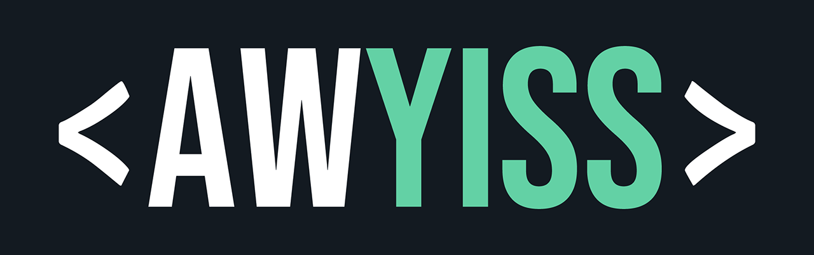

# Awyiss CMS



\
\


## Overview

**Awyiss CMS** is a powerful, flexible content management system built on top of the CakePHP framework.

It provides a robust foundation for creating modern, responsive websites, with a focus on ease of use and customizability.

It is designed to do the "heavy lifting" when building new websites, allowing developers to focus on delivering unique features and functionality for their clients
without the need to reinvent the wheel for common CMS tasks.

## Features

- **Advanced Content Management**:\
Intuitive interface for managing pages and contents
with a focus on flexibility and reusability
- **Widgets-Architecture**:\
Easily extendable with custom widgets
- **User Management**:\
Comprehensive user and permission management
- **Multilingual Support**:\
Built-in support for multiple languages in both Backend and Frontend
- **SEO Tools**:\
Tools to analyze optimize your content for search engines
- **Media Management**:\
Powerful media library with image manipulation
- **Form Builder**:\
Create and manage custom forms and protect them with predefined or custom protection mechanisms
- **Email Templates**:\
Design and customize email templates
- **Data Tables**:\
Flexible management of data that doesn't fit into other categories
- **Attributes System**:\
Extensible attribute management that allows customization, depending on your needs
- **Event System**:\
Hook into core functionality through events
- **Responsive Design**:\
Mobile-friendly backend interface and a solid foundation for building responsive frontends

## Requirements

- PHP 8.4 or higher
- MySQL 5.7+ or MariaDB 10.3+
- Composer
- Web server (Apache or Nginx) with URL rewriting enabled and rights to create symlinks
- Shell access with PHP CLI
- Cronjob support (often & long-running)
- Imagick or GD PHP extension (for image manipulation)
- FileInfo PHP extension
- Intl PHP extension

## Installation

> [!TIP]
> It's recommended to run the command as the web server user to ensure proper file permissions,
> for example using `sudo runuser -u <username> -- <command>` on Debian-based systems.


### 1. Install the Awyiss project

Since v0.3.0, Awyiss is available as a Composer package. Install it by running the following command in your terminal:

```bash
composer create-project awyiss/project your-project-name
```

This will create a new directory named `your-project-name` and install Awyiss along with its dependencies and a skeleton structure.

After Composer has finished installing the project, the Awyiss installer will automatically run and guide you through the installation
process.

### 2. Follow the installer prompts

The installer will ask you for the following information:

1. **Customer name**\
   Defines a unique identifier for your project. It will be used in various places, like the default namespace for plugins and themes. In
   case you enter an invalid name, you will be given a cleaned up version to accept.
2. **Database credentials**\
   If you leave the first prompt empty, the installer will not ask for the database credentials and will not create the database tables.
3. **Admin username**
4. **Admin password** *(if admin username was provided)*\
   If you leave the password prompt empty, the installer will create a random password for you and display it at the end of the installation
   process.
5. **Environment of install**\
   This setting will define the `CONFIG_ENV` variable in your `.env` file and affects the loading of assets and compilation of CSS files.
   Defaults to `development`.

> [!IMPORTANT]
> Passwords are visible when typed in the terminal.
> Don't use sensitive passwords during installation if you are in a public place or if others can see your terminal.

### 3. Configure your Web Server

Set up your web server to point to the `webroot` directory and create the cronjobs.

Example Cronjob entries:

```bash
*/10 * * * * cd /var/www/ && bin/cake queue run -q -g general >> /var/www/logs/cron.log 2>&1
*/1 * * * * cd /var/www/ && bin/cake media convert_files --include-avif --include-webp -q
```

The first cronjob processes the queued jobs every 10 minutes and is a long-running process. If your hosting provider does not allow
long-running processes, you can adjust the interval to a lower value (e.g. every minute); in that case, your local
`/<customer>/config/awyiss.php` should reflect the new interval, for example:

```php
'Queue' => [
    'workerLifetime' => 120, // 2 minutes instead of 600 seconds (10 minutes)
],
```

The second cronjob processes the media conversion queue every minute and stops as soon as all files are converted.

> [!IMPORTANT]
> If your web server cannot handle AVIF or WEBP images, you should not include the respective options in the cronjob for media conversion.
> See [Optional Steps](#7-optional-steps) for a command to check if your system supports these formats.
>
> **It is recommended to have at least one modern image format available to optimize images for web delivery.**

> [!TIP]
> You can often access the cronjob configuration with `crontab -e`, or for a specific user using `(sudo) crontab -e -u www-data`.

If your server serves JavaScript files via nginx, you may need to add the following configuration to your nginx config file:

```nginx
location ~* /ProgressCheckerWorker\.js$ {
   add_header Service-Worker-Allowed "/";
}
```

### 4. Access the Backend

You can now access the Backend at `http://your-domain.com/backend` and log in with the credentials you provided during installation.

The Frontend will currently show either the Awyiss 404 error page when in production mode or a `Not Found` exception message when in
development mode. To change this, you can start creating pages and contents.

> [!TIP]
> Did you type in your admin password wrong during installation or forgot it? You can reset it using the following command:
> ```bash
> bin/cake awyiss reset_password
> ```
> Follow the prompts to set a new password for your admin user.

### 5. Optional Steps

- Execute the `detect_available_commands` command

```bash
    bin/cake media detect_available_commands
```

    This will check if the cli tools are available (`ffmpg`, ImageMagicks `convert`, `mogrify`) and if certain formats are supported 
    (like `avif`, `webp`, `pdf` and `docx`).

- Create a backup of the initial installation

```bash
    bin/cake awyiss backup
```

> [!TIP]
> Awyiss creates multiple symlinks in the `webroot` folder to link assets from the core and your customer folder to eliminate the need for
building steps.
> - `/webroot/assets/` -> `/<customer name>/assets/`
> - `/webroot/awyiss/assets/` -> `/awyiss/assets/`
>
> To rebuild them, in case you delete them or move the installation, run:
> ```bash
> bin/cake awyiss install --rebuild-symlinks
> ```

## Documentation

More detailed documentation is available in the [official documentation](https://docs.awyiss.2f.media).

## License

**Awyiss** is licensed under the MIT License.\
See the [LICENSE](LICENSE) file for details.

## Support

For support inquiries, please contact [awyiss@2f.media](mailto:awyiss@2f.media).

---

© 2025-2026 Awyiss CMS. All rights reserved.
